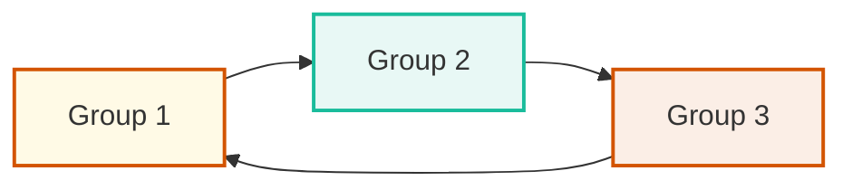

## 🔁 Redo Log Multiplexing

---

### 📘 What Are Redo Logs?

Redo logs store **all changes made to the database**, helping in **instance recovery** in case of crash or failure. These are critical for **data durability and integrity**.

---

### 🧾 What Redo Logs Contain:

Redo logs capture **every change made to data** at a **low level**, such as:

* 📝 **DML changes**:
  `INSERT`, `UPDATE`, `DELETE` — before/after image of modified rows
* 🔧 **DDL operations**:
  `CREATE TABLE`, `ALTER INDEX`, etc.
* 🧱 **Undo data**:
  Rollback data needed to reverse uncommitted transactions
* 📦 **Transaction control**:
  Marks for `COMMIT` and `ROLLBACK`
* 🔄 **Data dictionary changes**:
  Updates to system metadata like table/user definitions
* 📚 **Temporary tablespace activity** (during recovery if used)

> ✅ Redo logs **do NOT record `SELECT` statements** — only **modifications** to data

---

### 🧩 Redo Log Structure

* A **Redo Log Group** = one or more **Redo Log Members**
* Each **group** is written **in parallel** to all its members
* Oracle reuses groups in **circular fashion** 🔄

> ❗Redo logs are **vital for crash recovery**. Keeping them on a single disk = single point of failure!

---

### 🔄 Circular Working Mechanism



🌀 Oracle continuously **cycles through redo log groups**:
It writes to `CURRENT`, then switches to the next group in the sequence.

---

### 🔒 Why Multiplex Redo Logs?

To avoid **data loss or corruption** in case of disk or file failures.

### ✅ Benefits of Multiplexing:

* ✅ Reduces chance of losing redo data
* ✅ Continues operation even if one member is corrupted
* ✅ Oracle recommends it in **all production environments**

---

### 🧠 Redo Log Statuses (`V$LOG`)

| GROUP# | STATUS   |
| ------ | -------- |
| 1      | CURRENT  |
| 2      | ACTIVE   |
| 3      | INACTIVE |

```sql
SELECT GROUP#, STATUS FROM V$LOG ORDER BY GROUP#;
```

> ⚠️ **Only `INACTIVE` groups/members can be dropped safely**

---

### 🔎 Understanding Redo Log Status

* **CURRENT**: The group that Oracle is currently writing to
* **ACTIVE**: Required for crash recovery — Oracle has finished writing to it, but it hasn't been archived yet
* **INACTIVE**: No longer needed for recovery and can be reused or dropped

---

### 📏 How to Check Redolog Size (MB)

Connect to SQL\*Plus:

```bash
sqlplus / as sysdba
```

Use the following query:

```sql
SELECT GROUP#, BYTES/1024/1024 AS SIZE_MB FROM V$LOG ORDER BY GROUP#;
```

This helps you understand how large your redo logs are, to plan disk space and performance.

---

## ⚙️ Redo Log Multiplexing – Practical Steps (for ORADB)

---

### 🔍 Step 1: Validate Existing Redo Log Members


Run:

```sql
SET LINESIZE 200
COL MEMBER FOR A60
SELECT GROUP#, MEMBER FROM V$LOGFILE ORDER BY GROUP#;
EXIT;
```

👁️ Check if redo log members currently exist under `/u01/oradata/ORADB`.

---

### 📁 Step 2: Create Directory for New Members

If not already present:

```bash
mkdir -p /u02/oradata/ORADB
```

🏗️ This will act as the **second disk location** for new members.

---

### ➕ Step 3: Add New Members to Each Group

```bash
sqlplus / as sysdba
```

```sql
ALTER DATABASE ADD LOGFILE MEMBER '/u02/oradata/ORADB/redo01b.log' TO GROUP 1;
ALTER DATABASE ADD LOGFILE MEMBER '/u02/oradata/ORADB/redo02b.log' TO GROUP 2;
ALTER DATABASE ADD LOGFILE MEMBER '/u02/oradata/ORADB/redo03b.log' TO GROUP 3;
```

✅ Now each group is **mirrored**: 1 file in `/u01`, 1 in `/u02`

---

### 🧾 Step 4: Verify All Redo Members Are Added

```sql
SET LINESIZE 200
COL MEMBER FOR A60
SELECT GROUP#, MEMBER FROM V$LOGFILE ORDER BY GROUP#;
```

Confirm that each group has members in both directories (`/u01` and `/u02`).

---

## 🗑️ Drop Old Redo Log Members

---

### 🔍 Step 5.1: Check Log Group Status


```sql
COL STATUS FOR A10
SELECT GROUP#, STATUS FROM V$LOG ORDER BY GROUP#;
```

🎯 Look for **`INACTIVE`** groups — only those are eligible for dropping.

---

### 🔃 Step 5.2: Switch Logs to Make Groups INACTIVE (If Needed)

```sql
ALTER SYSTEM SWITCH LOGFILE;
ALTER SYSTEM SWITCH LOGFILE;
ALTER SYSTEM SWITCH LOGFILE;
ALTER SYSTEM CHECKPOINT;
```

🔁 Repeat the query until the targeted group becomes `INACTIVE`.

---

### ❌ Step 5.3: Drop Old Redo Log Members from `/u01` (One-by-One)

> 📌 Always **verify each group's status is `INACTIVE`** before dropping its member from `/u01`.

```sql
-- Check status
COL STATUS FOR A10
SELECT GROUP#, STATUS FROM V$LOG ORDER BY GROUP#;
```

If **Group 1** is `INACTIVE`, then:

```sql
ALTER DATABASE DROP LOGFILE MEMBER '/u01/oradata/ORADB/redo01b.log';
```

Switch logs and check for **Group 2**:

```sql
ALTER SYSTEM SWITCH LOGFILE;
ALTER SYSTEM CHECKPOINT;
SELECT GROUP#, STATUS FROM V$LOG ORDER BY GROUP#;
```

If **Group 2** is now `INACTIVE`, then:

```sql
ALTER DATABASE DROP LOGFILE MEMBER '/u01/oradata/ORADB/redo02b.log';
```

Repeat for **Group 3**:

```sql
ALTER SYSTEM SWITCH LOGFILE;
ALTER SYSTEM CHECKPOINT;
SELECT GROUP#, STATUS FROM V$LOG ORDER BY GROUP#;
```

If **Group 3** is now `INACTIVE`, then:

```sql
ALTER DATABASE DROP LOGFILE MEMBER '/u01/oradata/ORADB/redo03b.log';
EXIT;
```

---

### 🧹 Step 5.4: Remove Physical Files at OS Level

```bash
rm /u01/oradata/ORADB/redo01.log
rm /u01/oradata/ORADB/redo02.log
rm /u01/oradata/ORADB/redo03.log
```

📁 Oracle **does not** delete the file automatically.

---

### ➕ Step 5.5: (Optional) Resize Redo Logs – Drop and Recreate

If you want to resize redo logs (e.g., from 50MB to 100MB), follow these steps **after multiplexing is complete**:

1. Ensure all groups are `INACTIVE` (except the `CURRENT` group).
2. Drop one group at a time:

```sql
ALTER DATABASE DROP LOGFILE GROUP 2;
```

3. Recreate it with desired size and members:

```sql
ALTER DATABASE ADD LOGFILE GROUP 2 (
  '/u01/oradata/ORADB/redo02a.log',
  '/u02/oradata/ORADB/redo02b.log'
) SIZE 100M;
```

Repeat for other groups.

> ⚠️ Never drop the `CURRENT` log group.

---

### 📌 Summary Table

| ✅ Step | Description                                       |
| ------ | ------------------------------------------------- |
| 1      | Check current redo members via `V$LOGFILE`        |
| 2      | Create new directory `/u02/oradata/ORADB`         |
| 3      | Add members to each group                         |
| 4      | Verify new members are added correctly            |
| 5.1    | Check if log groups are `INACTIVE`                |
| 5.2    | Force switches + checkpoint to make them inactive |
| 5.3    | Drop old members from `/u01` (one-by-one)         |
| 5.4    | Manually remove old redo files from disk          |
| 5.5    | Resize redo logs by recreating them    |

---
