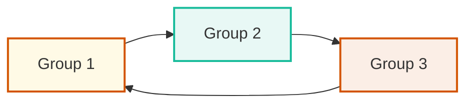

## 🔁 Redo Log Multiplexing 

### 📘 What Are Redo Logs?

Redo logs store **all changes made to the database**, helping in **instance recovery** if there's a failure.

### 🧾 What Redo Logs Contain:

Redo logs capture **every change made to data** at a **low level**, such as:

* 📝 **DML changes**:
  `INSERT`, `UPDATE`, `DELETE` — actual before/after image of row changes
* 🔧 **DDL operations**:
  `CREATE TABLE`, `ALTER INDEX`, etc.
* 🧱 **Undo (rollback) data**:
  To help roll back uncommitted transactions
* 📦 **Transaction control**:
  Marks for `COMMIT` and `ROLLBACK`
* 🔄 **Changes to data dictionary**:
  System metadata like table definitions or user roles
* 📚 **Temporary tablespace activity**, if needed for recovery

> ✅ Redo logs **do not store SELECT statements** — only **changes** to data

### 🧩 Structure

* A **Redo Log Group** = one or more **Redo Log Members**
* Each **group** is written **in parallel to all members**
* Oracle reuses redo logs in **circular fashion** 🔄

> ❗Redo logs are **critical** for data recovery. They must never be stored on a single disk.

---

### 🔄 Circular Working Mechanism



🌀 Oracle continuously **cycles through redo log groups**.
It writes to `CURRENT`, switches to the next, and so on.

---

## 🔒 Why Multiplex Redo Logs?

To avoid **data loss** in case of disk failure.

### ✅ Benefits

* Protects against log corruption
* Enables recovery when one member is damaged
* Recommended in **production** environments

---

## 🧠 Redo Log Statuses (`V$LOG`)

| Status     | Meaning                                            |
| ---------- | -------------------------------------------------- |
| `CURRENT`  | Log group **actively being written to**            |
| `ACTIVE`   | Needed for crash recovery, **not yet overwritten** |
| `INACTIVE` | No longer needed — **safe to drop**                |

Check with:

```sql
SELECT GROUP#, STATUS FROM V$LOG ORDER BY GROUP#;
```

> ⚠️ Drop only when **status is `INACTIVE`**

---

# ⚙️ Redo Log Multiplexing – Practical Steps (ORADB)

---

### 🔍 Step 1: Validate Existing Redo Log Members

```sql
SELECT GROUP#, MEMBER FROM V$LOGFILE ORDER BY GROUP#;
```

👁️ Review current redo log structure. You'll likely see members in `/u01/oradata/ORADB`.

---

### 📁 Step 2: Create Directory for New Members

```bash
mkdir -p /u02/oradata/ORADB
```

🏗️ This is your **new mount point** to multiplex redo members.

---

### ➕ Step 3: Add New Members to Each Group

```sql
ALTER DATABASE ADD LOGFILE MEMBER '/u02/oradata/ORADB/redo01b.log' TO GROUP 1;
ALTER DATABASE ADD LOGFILE MEMBER '/u02/oradata/ORADB/redo02b.log' TO GROUP 2;
ALTER DATABASE ADD LOGFILE MEMBER '/u02/oradata/ORADB/redo03b.log' TO GROUP 3;
```

✅ Now each group has **two members** — one in `/u01`, one in `/u02`.

---

### 🧾 Step 4: Verify All Redo Members Are Added

```sql
SELECT GROUP#, MEMBER FROM V$LOGFILE ORDER BY GROUP#;
```

Ensure that each group has both `/u01/` and `/u02/` log files.

---

# 🗑️ Drop Old Redo Log Members (Only When Safe)

---

### 🔍 Step 5.1: Check Log Group Status

```sql
SELECT GROUP#, STATUS FROM V$LOG ORDER BY GROUP#;
```

🎯 Look for **`INACTIVE`** — only those can be dropped.

---

### 🔃 Step 5.2: Force Log Switches to Make Groups INACTIVE

```sql
ALTER SYSTEM SWITCH LOGFILE;
ALTER SYSTEM CHECKPOINT;
```

Repeat until the target group becomes `INACTIVE`.

---

### ❌ Step 5.3: Drop Old Redo Log Members from `/u01` (If INACTIVE)

```sql
ALTER DATABASE DROP LOGFILE MEMBER '/u01/oradata/ORADB/redo01a.log';
ALTER DATABASE DROP LOGFILE MEMBER '/u01/oradata/ORADB/redo02a.log';
ALTER DATABASE DROP LOGFILE MEMBER '/u01/oradata/ORADB/redo03a.log';
```

🚫 Never drop redo logs from groups in `CURRENT` or `ACTIVE`.

---

### 🧹 Step 5.4: Remove Physical Files (OS Level)

```bash
rm /u01/oradata/ORADB/redo01a.log
rm /u01/oradata/ORADB/redo02a.log
rm /u01/oradata/ORADB/redo03a.log
```

📁 Oracle doesn’t delete the files automatically — this step is manual.

---

## 📌 Summary

| ✅ Step | Task                                         |
| ------ | -------------------------------------------- |
| 1      | Check current redo log members (`V$LOGFILE`) |
| 2      | Create `/u02/oradata/ORADB` if needed        |
| 3      | Add new members for each group               |
| 4      | Verify members for all groups                |
| 5.1    | Identify `INACTIVE` groups                   |
| 5.2    | Switch logfiles + checkpoint if needed       |
| 5.3    | Drop old members from `INACTIVE` groups      |
| 5.4    | Manually delete files from `/u01`            |

---
